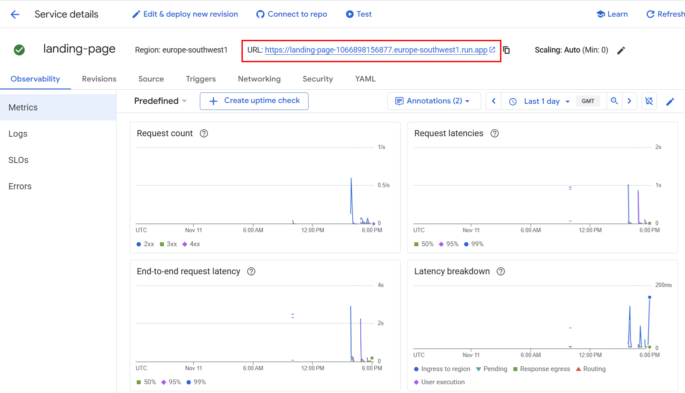

# Micro-frontend Router

## Overview

This project uses Cloudflare Workers to act as a router for a micro-frontend architecture. Since each micro-frontend service is deployed to a different account and has a unique URL, this worker provides a single entry point to aggregate and route requests to the appropriate service based on the request path.

## Routes

The routing logic is defined in `src/routes.ts`. The file exports an array of `Route` objects, where each object has a `path` and a `destination`.

```typescript
export interface Route {
	path: string;
	destination: string;
}

export const routes: Route[] = [
	// ... routes
];
```

The router iterates through the routes in the order they are defined. The first route that matches the beginning of the request's path will be used. Therefore, **it is important to define routes in order of priority, from most specific to most general.**

For example, a request to `/test/subpath` will match the `/test` path.

## Usage

### Prerequisites

- Node.js and npm
- Wrangler CLI

### Installation

1. Clone the repository.
2. Install the dependencies:
   ```bash
   npm install
   ```

### Running locally

To start the development server, run:

```bash
npm run dev
```

### Deployment

To deploy the worker to Cloudflare, run:

```bash
npm run deploy
```

Note: Deployment is handled automatically via GitHub Actions on push to the `main` branch.

## Adding a new route

To add a new route, you need to:

1.  Get the URL of your service.
    
2.  Open `src/routes.ts`.
3.  Add a new route object to the `routes` array, **remembering the priority order**.

After adding the route, open a Pull Request to have it reviewed and merged. To speed up the review process, you can contact Henrique Sardo Fernandes on Teams. If the review is taking too long, feel free to contact anyone from the T01G01 group.

```typescript
export const routes: Route[] = [
	{
		path: '/new-service',
		destination: 'your-service-url',
	},
	// ... other routes
];
```
